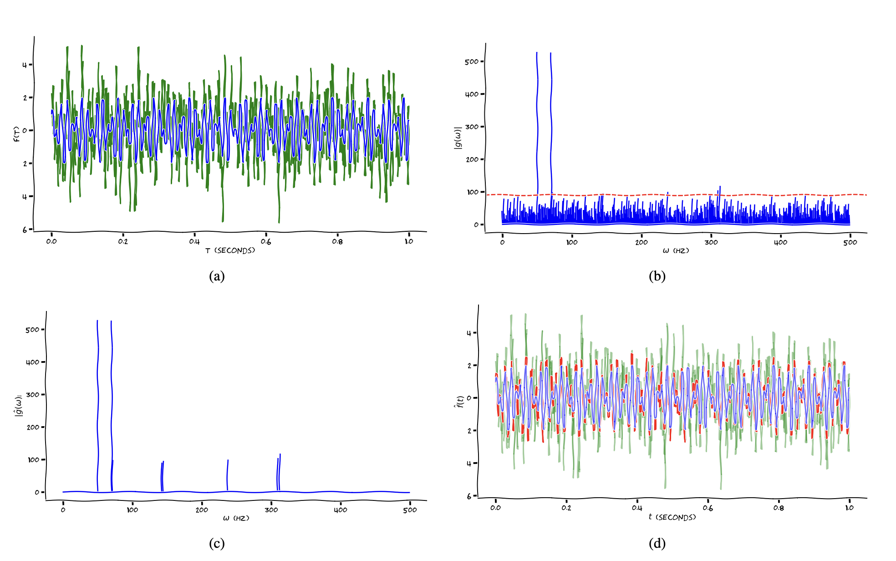

# This repository contains code for Denoising signal using Fourier Transformation




This project explores the application of the Fourier Transform (FT), a widely used technique in applied mathematics, particularly in signal processing and data compression. The Discrete Fourier Transform (DFT) and the Fast Fourier Transform (FFT) are practical variants of the FT, with FFT being more efficient for large-scale problems. The project addresses the challenges of analyzing measured data and signals, which often contain noise due to unpredictable circumstances and systematic measurement errors. The noise is typically modeled as Gaussian white noise. The project implemented the FT-based amplitude thresholding noise removal framework for denoising. To demonstrate the effectiveness of the framework, we evaluate on a variety of 1D datasets, including synthetic and real-world signals. Based on the performance of the framework, we realized that the implemented framework is useful for reducing noise in data, however, the we should be critical in choosing threshold value to get best performance.

*Technqiue report can be accessed via [here](./doc/FT_based_denoising_technique_report.pdf)*

## Usage

### Prerequisite installation
```
python==3.11.5
numpy==1.24.3
matplotlib==3.7.2
```

### Demonstation
Simply one of these following commands below to generate the plots for progress of denoising.
```
    python ./ibm_dataset_demo.py

    or 

    python ./synthetic_signal_demo.py
```
The results should be found at `./output/demo/`

### Signal denoising (reconstruction)
By running these bash lines below, we will get the plots stored at `./output/signal_reconstruction/`

```
    python ./signal_reconstruction.py
```
If you change the signal type, or modify the configuration, to go the file `./signal_resconstruction.py` to edit.

### Optimal thresholding

For trigonometric signals
```
    python threshold_performance_synthetic_signal.py --signal_type trig \
        --sampling_rate 1000 --mean 0 --var 2 --realization 100 \
        --output_dir output/optimal_threshold/trig/
```

For polynomial signals
```
    python threshold_performance_synthetic_signal.py --signal_type poly \
        --sampling_rate 1000 --mean 0 --var 1 --realization 100 \
        --output_dir output/optimal_threshold/poly/
```

For IBM dataset
```
    python threshold_performance_ibm_dataset.py --input_data ./data/ibm_stock_2022_Jan2March.csv \
        --num_samples 2000 --sampling_rate 1000 \
        --output_dir ./output/optimal_threshold/ibm_dataset/
```

The results should be found at `./output/optimal_threshold/` directory.


Email: *tiennvcs@gmail.com*


